# cpore

A Spore-like life simulation written from scratch in C, built to be a
reinforcement learning environment rather than a game.


Dependencies: `libc` and `libm`. No SDL, no OpenGL, no zlib, no stb.

That screenshot is a renderer written from scratch, and so is the PNG it was
compressed into. The cell stage draws through `drop`: a linear HDR buffer at
the output resolution, analytically antialiased primitives, four octaves of
bloom, a filmic tonemap and a lens pass, with no palette and no upscale
anywhere in it. The organising idea is darkfield illumination — light a
specimen obliquely and you see only what it scattered, so the field goes black
and anything transparent blazes along its edges. It is how pond water is
actually photographed, and it means a cell reads by its rim rather than its
fill, which costs one `sqrt` per pixel.

The other six styles are a pixel-art pipeline: hard-edged primitives (coverage
thresholded at the pixel centre, never blended) into a small buffer, quantised
to a fixed palette with 4x4 ordered dithering, then blown up with
nearest-neighbour. They are still there, still the only path stages 2 to 4
have, and `--vis abyss` gets the old look back. The trade is visible in the
repository: a palette frame is ~60KB because few colours suit LZ77 well, and
the frame above is 1.5MB.

```
make && make test && make bench
./build/cpore_shot --list-parts
./build/cpore_shot --style hunter --seed 23 --steps 2600 --out shot.png
./build/cpore_shot --parts 2:0,7:16,4:112,4:144 --out custom.png
./build/cpore_shot --vis-all --out compare.png      # every style, same frame
./build/cpore_shot --vis abyss --out pixels.png     # the original pixel look
```

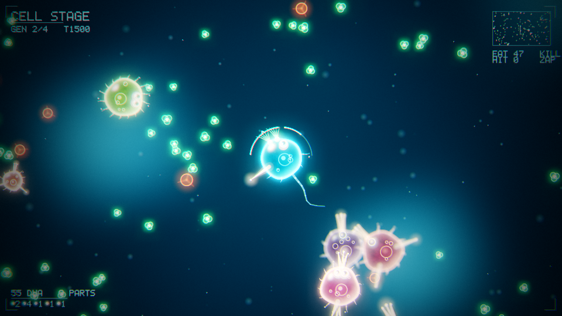

## Stage 2: aquatic, in 3D


A real volume of water — 1400 x 620 x 1400, surface above, seabed below, and
**depth as a genuine axis of the problem**. Light falls off exponentially with
depth, plankton blooms near the surface, carrion sinks. A build that cannot see
in the dark cannot hunt there, so photophores are the only sight you can buy
that the depth cannot take away.

Body plans are three-dimensional: a genome is a spine of 2–6 segments plus up
to 10 parts, each mounted at **a segment index and a yaw/pitch on that
segment** — a direction in 3D, not an angle on a circle. Bite cones, armour
coverage and thrust are all resolved against those directions.

### Every animal is different


`./build/cpore_aqua --gallery 3 --seed 5` — eight genomes drawn at random from
the same design space.

Getting there needed the genome to carry things that actually change a
silhouette. It used to have one `girth` scalar and a straight spine, which is
combinatorially large and visually tiny — every fish was the same shape in one
of six tints. It now carries:

- a **four-station radius profile** along the body, which is the difference
  between "fatter" and eels, discs, barrels and tadpoles
- **arch and sweep**, bowing the spine up/down and sideways
- **per-part scale**, so a fin is not always fin-sized
- **bilateral symmetry as a gene** — a mirrored part exists on both flanks and
  costs twice. This is the single thing that makes a generated body read as an
  animal rather than a lump, so it is inherited, mutated and paid for.
- a **colour genome**: base and marking hue, saturation, value, and one of
  plain / bands / spots / countershading, at a mutable frequency

Colour carries as much perceived variety as shape and is far cheaper, so it
gets its own genes and its own inheritance. Markings are deliberately crisp
rather than gradients, because a 32-colour palette punishes soft ramps.

| part | DNA | what it does |
| --- | --- | --- |
| filter / jaw | 5 / 12 | plankton / meat, and bites through a cone |
| fin / tail | 6 / 8 | turn rate / forward thrust |
| spike / plate | 10 / 12 | directional damage and armour / flat armour, heavy |
| eye | 6 | perception — but multiplied by how much light there is |
| lung | 10 | buoyancy control, so holding a depth stops costing thrust |
| light | 14 | a photophore: sight the depth cannot take away |

### Rendering bodies

Creatures are a **signed distance field unioned with a smooth minimum**, ray
marched per pixel. That one operator is the difference between a body and a
bag of parts: `smin()` fillets every junction instead of letting primitives
intersect as separate lobes. It also sidesteps the entire mesh pipeline — no
triangles, no UVs, no rigging — which is exactly why it suits bodies that are
generated rather than authored.

| before: plain union, sphere impostors | after: smooth-minimum SDF |
| --- | --- |
|  |  |

The clamp inside `creature_sdf` is load-bearing, and the first attempt did not
have it. Chaining `smin()` over sixteen primitives compounds its correction
term — each union can subtract up to `k/4` — so with a generous blend radius
the field collapses far outside the body, the marcher hits the bounding sphere
immediately, and every animal renders as one enormous ball. Tracking the true
minimum alongside and refusing to blend more than one fillet below it keeps the
field honest however many parts a genome piles on.

### Lighting

Key, fill and ambient are separate terms with real separation between them,
because one flat ambient floor squeezed every surface into the same six mid
tones and left the palette's darks and brights unused. Occlusion and soft
shadows come straight out of the distance field. Output is tonemapped
filmically rather than clamped — three light terms plus emissive routinely
exceed 1.0, and clipping turns a bright surface into a flat plate of one
colour that then quantises to a single palette entry, throwing away the shape
underneath.

Two bugs worth recording. Fog was mixing every surface toward blue-grey before
quantisation, so saturated genomes arrived desaturated and landed on neutral
palette entries; it is now held off for the first 90 units, which keeps
foreground animals at full chroma while still burying the distance. And the
sun vector pointed *up* — y is depth here, so light travelling down from the
surface is +y, and with −1 the key lit every belly and left every back black.

Depth also carries caustics on the seabed, light shafts along the sun's
bearing, projected shadow patches that widen and fade with an animal's height,
and drifting streaked marine snow. A depth-discontinuity outline pass runs last
and is the cheapest readability win in the file.

Everything else is still a **sphere impostor into a z-buffer**: centres are
projected, screen-space circles rasterised, depth and normal solved per pixel.
Surface and seabed are analytic ray-plane intersections. Creatures smaller than
9 px on screen fall back to impostors, since ray marching a body costs far more
than splatting spheres and at that size nobody can tell. A 320x180 frame costs
roughly 40 ms. Output goes through the same palette pipeline as stage 1.

## Stage 3: creature, and four ways to live


`cp4_height()` is a pure function of seed and position, so the world stores no
terrain at all — the simulation asks for the ground under an animal's feet, the
renderer asks wherever a ray lands, and a snapshot is still a `memcpy` of one
POD struct. Because nothing is stored, **nothing has to be bounded**: there are
no walls, and what keeps the world finite is a resident window of flora,
animals and nests that is recycled from behind the player to in front of them.
Walk in one direction for a whole episode and the world comes with you, and the
species ahead are ones you have not met.

The stage has **four media**, and each is gated by a part rather than scaled by
one. A body without fins does not swim slowly — it flounders and drowns. That
is what makes a fin a decision instead of a stat bump, and it is the same shape
as the mouth gate on what an animal can eat:

| medium | needs | costs | pays |
|---|---|---|---|
| ground | legs | baseline | bushes, and carrion |
| water | fins, and gills or a breath meter | least upkeep | kelp |
| air | wings, and lift has to beat mass | 1.75× upkeep | range — sight scales with altitude |
| underground | digging claws | 1.3× upkeep, slow | tubers, and nothing on the surface can follow |

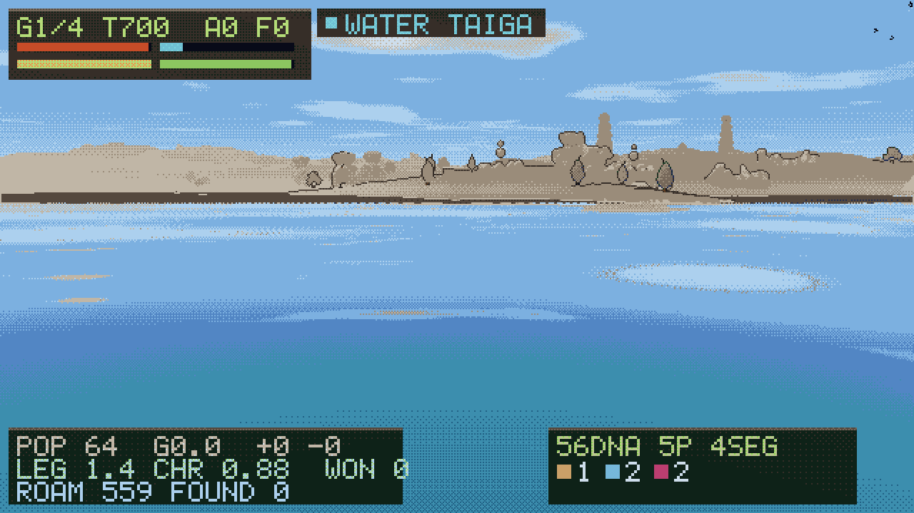
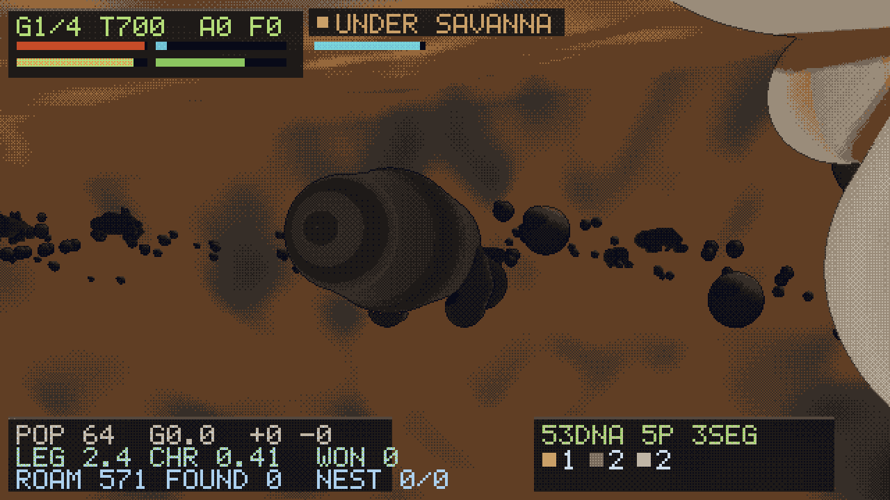

Every medium has its own food, so a medium is somewhere worth going rather than
somewhere you merely can go. Air is the exception: what the sky pays is range,
which in a world with no edges is what finds the next species to impress.

**Biomes** are the other half of making distance mean something. Temperature
and moisture are two more pure functions of position, so they cost no storage
and stream for free; temperature also falls with altitude, which is what puts
snow on a peak in the middle of a savanna. Eight biomes fall out of the pair,
and fertility varies fivefold across them — a desert is not a different colour,
it is a place where crossing costs you and almost nothing grows. `--climate`
prints the mix and a coarse map:

```
seed 42                  seed 7                   seed 21
  ice      14.3%           ice      13.3%           forest   54.7%
  taiga    18.0%           savanna  17.4%           grass    16.0%
  forest   17.8%           forest   13.1%           taiga     9.0%
  ...                      jungle    9.2%           jungle    6.2%
```

Seeds have character: 42 is cold and forested, 7 is hot with savanna and
jungle, 21 is one big temperate wood.

**Day and night** make the world vary in time as well as space — a full cycle
every 2000 steps, so an episode covers four and a half of them. It is a
mechanic rather than a filter: darkness takes sight away and leaves hearing
alone, so the crossover is real and measured.

| | daylight | midnight |
|---|---|---|
| two eyes | sees 640 | 269 |
| two ears | 260 | **510** |

An ear stops being the part you buy with spare budget. The flyer noticed
first — once night cut sight on the ground, it went from 12% of its life
airborne to 22%, because altitude is the one thing that still helps.

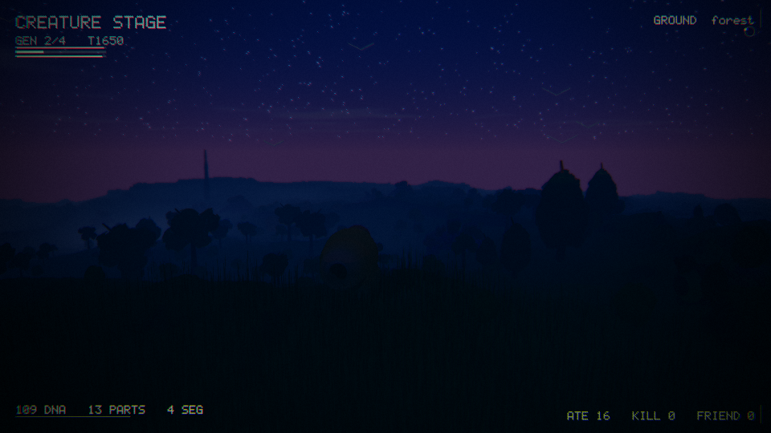

Six archetypes, each run from its own starting build by the scripted baseline
over twelve seeds — the point of the table is that the specialists actually
live in their medium and eat from it:

| build | evolved | ground / water / air / under | eats |
|---|---|---|---|
| swimmer | 17/30 | 6% / 92% / 1% / 0% | 1117 kelp |
| predator | 14/30 | 98% / 1% / 0% / 0% | 241 carrion |
| charmer | 7/30 | 97% / 2% / 0% / 0% | 699 bushes, 675 songs |
| burrower | 1/30 | 68% / 1% / 0% / 29% | 169 tubers |
| grazer | 0/30 | 97% / 1% / 1% / 0% | 896 bushes, 691 songs |
| flyer | 0/30 | 90% / 1% / 7% / 0% | 678 bushes, 198 species found |

Twelve seeds turned out to be too few to tune against — a change that only
shuffles the RNG stream re-rolls every outcome, and I spent a while chasing
swings that were noise. `--seeds 30` is the honest read.

**These numbers are down and the creature-creator work is why.** Before it the
spread was 18/16/14/7/7/6; the wider genome, the two new parts and the raised
budgets moved it to 17/14/7/1/0/0. Predator and swimmer hold; the four
archetypes that fill their meter socially do not. What the measurements say is
that everything in the world got a bigger genome at the same time the player
did, and the rivals converted it better - deaths are up across the board and
species-encountered nearly doubled. Three tuning rounds narrowed it (buy order,
the leg-length coupling, the budgets) without closing it, and guessing further
is how you tune against noise. It needs a pass of its own, against the tables
rather than against intuition, and it has not had one.

Terrain moved these once and then stopped moving them. Domain warping and
derivative-damped octaves put real relief in the ground, and relief costs a
grazer more than it costs anyone else: the grazer fell from 11/30 to 6 while
the predator went 23 to 19. The rivers-and-provinces rewrite that followed
left the table where it was (18/16/14/7/7/6 against 19/18/15/7/6/6), which is
inside the seed noise — so the shift belongs to relief, not to everything that
came after it. All six archetypes still reach the goal and all four media
still carry a population; the food economy has not been retuned for the wider
spread.

How much of a world is sea varies a lot by seed — 6% to 48% across the four
seeds spot-checked — which is character rather than a fault, but it does mean
the swimmer's result is partly a question of where it woke up.

You can also **build a nest**. It costs energy, it banks the food you carry
back to it, it heals you, and once the larder is full it hatches a follower
carrying a mutated copy of your own genome. Followers are a lineage rather than
a summon: they travel with you, they eat, and they can be killed.

**Species remember you inside an episode.** Selection across generations was
already there and is slow; what was missing was a lineage reacting to what you
did to it ten seconds ago. Three memories, all decaying, all visible in the
observation so an agent can respond to them:

| you did | they learn | so |
|---|---|---|
| attacked them | wariness | they break off and run while a naive herd is still grazing |
| attacked from behind | guard | they back away facing you, denying the arc a claw wants |
| sang the same song | fatigue | a display is worth 41% less by the fourth round |

Measured, not asserted: a song buys `+0.2275` standing per listener at first
and `+0.1343` by the fourth round. Wariness reaches 0.99 after a few dozen
blows and fades to 0 if you leave them alone — a mood, not a grudge. That
fatigue is also what turns the social path into a tour rather than a loop:
standing in one place singing at one nest stops working, and the world has no
edges to stop you walking to the next one.

Rival nests still breed, mutate and are selected by whether their occupants can
feed themselves — and they now know about media too, siting an aquatic lineage
in water and letting a clawed one dig for its own roots. Over five worlds with
no player intervention, six generations turn over and the population's mobility
rises on its own.


```
./build/cpore_land --list-parts
./build/cpore_land --style swimmer --seed 3 --steps 1200 --out water.png
./build/cpore_land --style burrower --seed 16 --out under.png
./build/cpore_land --table --seeds 30    # every archetype, every medium
./build/cpore_land --climate --seed 42   # what this world is made of
./build/cpore_land --map --seed 21 --span 26000 --out map.png
./build/cpore_land --map --seed 21 --span 5000    # the same world, close up
./build/cpore_land --gallery 3 --seed 11 --out gallery.png
./build/cpore_land --creature --style charmer --out charmer.png
./build/cpore_land --creature --seed 42 --out random.png   # four views + stats
```

### The creature creator

| 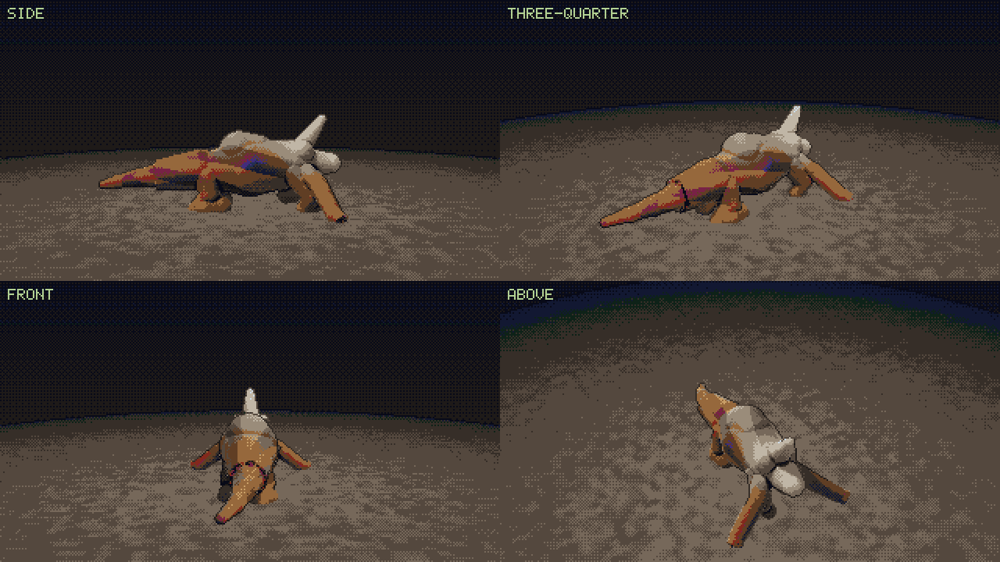 |
|---|
| 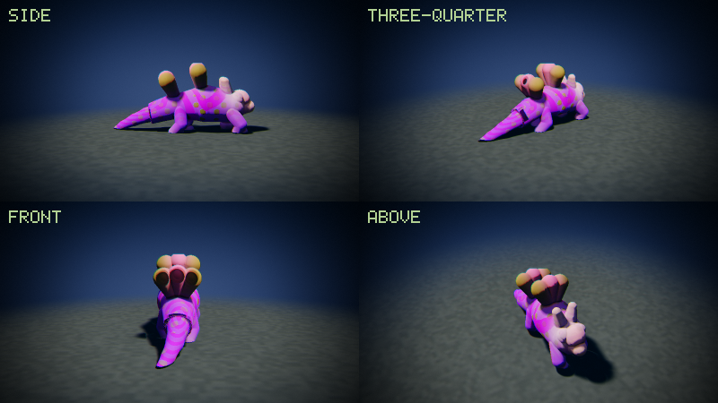 |

`--creature --style charmer` builds an archetype at the last generation's
budget and renders it from four angles with the stat block its parts actually
bought. Half the genome — every yaw, the limb proportions, the third coat —
simply does not show from one fixed side, which is why the gallery had been
lying to me for weeks.

The genome carries, per part: what it is, which segment it mounts on, its yaw
and pitch, its scale, **how long it is**, and **how far its joint folds**. The
last two are the difference between a parts bin and an editor. In Spore the
thing you spend most of your time on is dragging a limb out to the length you
want and setting the way it bends, and until this every leg on every animal in
the world was the same leg at a different scale.

| | |
|---|---|
| **19 part types** | arms and tails join the original seventeen |
| **16 slots** | up from twelve |
| **jointed limbs** | legs, arms and tails are multi-link chains with per-part reach and fold |
| **spine** | segment count, girth, a four-point profile, per-segment lumps *and* per-segment rise, plus arch and sweep |
| **three coats** | base, marking and detail, each with its own pattern and scale — Spore's paint mode |
| **design head** | six numbers a part in the action vector, up from four |

**Arms** are a leg that does not have to reach the ground, and that one
difference is what makes them worth having as a separate part: freed from the
floor, they point where the gene aims them. They lengthen every contact the
animal makes — a blow lands from further out and so does a display — they
browse what a mouth alone cannot reach, and they let you provision a nest
faster, which is the only thing that turns food into descendants.

**Tails** are counterweights: turn, grip, jump, stamina. They deliberately do
*not* pay charm, however much a real one is a display organ. The stage turns
on charm and violence being bought from the same budget, and a cheap part that
quietly pays into both blunts the fork — with it, the predator archetype
started winning encounters by impressing them, and the test that checks it wins
by eating went red.

Limbs wear the animal's own skin. Given their own grey they read as
prosthetics bolted to a coloured torso, and with sixteen slots most of a
silhouette is limb — so most of the animal came out pale grey whatever its
genome said. Claws, horns, plates and eyes keep their own material, because
those are the parts that are supposed to look like a different substance.


### Generating the terrain

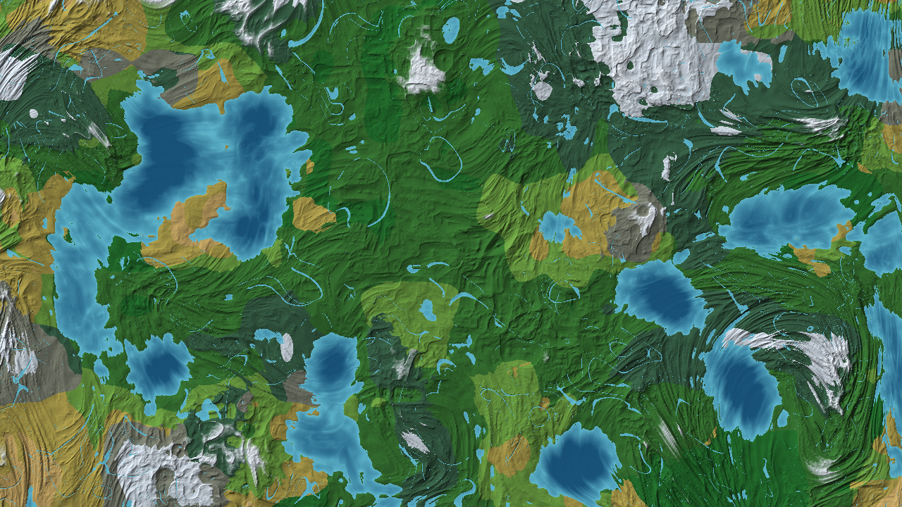

The whole world from overhead, from `--map`. This view is the one that made
every terrain bug obvious, because a first-person shot can only tell you
whether a hillside looks right — it cannot tell you whether the world has
geography. Ranges that run, rivers that join and reach the sea, a coast with
something to say: those are visible in one glance from above and nowhere else.
`--map --span 5000` zooms in.

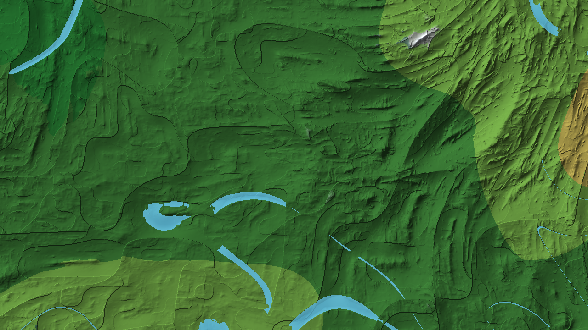

**The budget came first.** Stage 3 spends essentially all of its simulation
time inside `cp4_height` — 470-odd calls a step, and near enough all of the
step's cost — so anything that makes the terrain prettier makes the
environment slower, one for one. Two of those calls a step were free to
recover: 220 of them existed only because `cp4_normal` took four central
differences to work out a gradient the fBm already computes on its way past,
and one per animal per step was the same position evaluated twice in a row.
Returning the analytic slope costs a handful of multiplies on hashes that have
already been paid for. Stage 3 came out **39% faster with much more terrain in
it** — 8.7k → 11.9k steps/s under the scripted baseline.

**Ruggedness provinces.** One low-frequency field decides how much detail each
octave keeps and how creased it is, so the world has *kinds of country*: worn
plains where it is low, badlands and arêtes where it is high. Without it every
square kilometre is hilly in the same way, which is the single thing that most
makes a procedural world read as procedural.

**Folded ranges.** The first three octaves are sampled in a frame stretched
along a slowly turning direction field, so ridges run in lines with foothills
off their flanks. The last three are sampled square, because they are texture
and texture has no grain — stretching all six looked exactly like what it was,
the whole world combed in one direction. How strongly a province is folded is
tied to its ruggedness, so the folded belts are the rugged country.

**Rivers**, which is the one thing no amount of shading could put back. Real
terrain is beautiful mostly because water has been through it. Proper
hydrology needs flow accumulation, which needs the whole map at once, which
this world will never have — so the channels are drawn rather than eroded, and
the trick is *where* they are drawn. `|2n-1|` is near zero along a curve, and
sampled in a frame stretched four to one along the local downhill direction
those curves run *with* the gradient instead of across it, converging where
the ground converges. Water is worked out in the same pass that cuts the bed,
because that is the only place that knows how deep the cut was, and the pair
comes back from `cp4_height_water()`. A river is water in every sense the
simulation has: `medium_at` compares against the local waterline rather than
one global sea level, so a channel deep enough to swim in is one you can swim
in.

**A ragged coast.** The continental field is smooth, so without help every
shore is a long clean curve. A band of higher-frequency noise around sea level
— and nowhere else, so the interior pays nothing — gives headlands, inlets and
offshore rocks.

**Two continental octaves.** One octave of value noise is one lattice, and
from orbit that is exactly what it looked like: seas arranged on a grid, one
bay per cell. A second octave at 1.73× on a turned axis shares no period with
the first, so the coastline stops being able to tell you where the lattice is.

Four failures worth keeping, because each one was invisible from the ground
and unmissable from above:

| what it looked like | what it was |
|---|---|
| a lattice of starbursts, one per continental cell | the stretch direction taken from a gradient, which spins through a full turn around every point where the gradient vanishes |
| the whole world combed like brushed metal | anisotropy applied to all six octaves instead of the three that carry structure |
| a canal system laid over the hills, in closed loops | river channels as level sets in world axes — a level set is a contour, and contours close |
| hairline cracks crazing every hillside | the tail of the river mask cutting a groove wherever it was faintly non-zero |

### Making the landscape worth looking at

A heightfield, a sun and a fog colour will get you a picture of terrain. It
will not get you a place. Six things, in the order they mattered:

**The ground itself**, which is the section above — domain warping, ridged
octaves fading to plain, derivative damping, provinces, folded ranges and
rivers. Everything below is shading, and shading cannot rescue a shape.

**Aerial perspective, per channel.** Distance used to be a lerp toward one
horizon colour, which is why every ridge past a kilometre came out the same
flat grey. Air absorbs the ground's own colour on the way to the eye — blue
least — and scatters sunlight into the beam along its whole length, blue away
from the sun and warm toward it. Three extinction lengths and one phase term.
The scale lengths are set against this world's view distance rather than a real
atmosphere's: written long enough to be physical they do nothing over two and a
half kilometres, and the far coast came back as a black bar.

**Things standing on it.** Trees, boulders and snags hashed straight out of the
cell they stand in — nothing stored, nothing simulated, streams with the
unbounded world for free. Two size classes rather than one range, because a
stand where every trunk is within a factor of two of every other reads as a
crop. Trees stop above the snowline, which is most of what makes a mountain
read as a mountain rather than a tall green hill.

**Ambient occlusion on the terrain.** Creatures had it since stage 2 and the
ground did not, and it showed: a gully and a ridge crest with the same normal
were painted the same colour. Sixteen height samples on rings that grow
quadratically, asking how much sky each point can see. The canopy is folded in
from the same cell hash — a wood without it is a set of stickers on a lawn.

**Ground cover.** The near ground was the last thing wrong, and it was wrong by
being correct: shaded, occluded, textured, and still obviously a painted
surface, because at ten units away a meadow is not a surface at all. Tufts of
tapered slivers on a fine grid, following the same fertility the flora does, so
a desert stays bare and a jungle floor is thick.

**A palette that has a sky in it.** All of the above still quantised through
`abyss`, which was mixed for a lit water column. `terra` is 48 entries with six
steps of sky, two foliage ramps and warm rock, at 640x360.

**Trees that are not spheres.** A pixel-art landscape lives on its silhouettes,
and a circle reads as plastic whatever colour it is painted. Two changes: the
trunk and boughs are drawn with the same tapering-line primitive the grass
uses, because what tells you a tree is a tree at fifty units is the branching;
and each crown lobe has its rim eaten away by a hash of the *world-space*
surface point, quantised to a fraction of the radius. World space is the part
that matters — erode in screen space and the foliage boils as the camera
moves.

**Sunlight that changes colour.** A constant warm white is the most expensive
simplification in a daylight renderer: it makes noon and the last ten minutes
before dusk the same picture at different brightnesses, and the last ten
minutes before dusk are the reason anyone photographs landscapes. Sun colour
now comes from sun elevation — the same physics the aerial perspective already
models, seen from the sun's end. One lerp buys the whole golden hour.

**Mist that pools in the low ground.** Aerial perspective is uniform: it makes
a valley floor and the ridge above it equally blue, so the landscape flattens
into layers of the same wash. Mist has a scale height. Density falling
exponentially with altitude integrates along a straight ray in closed form —
one `exp` and a divide for what a marcher would charge fifty samples for — and
it is what separates one ridge from the next at dawn. Tied to the daylight
curve, so the two crossings of the day are the ones with weather in them.

**Cloud shadows**, cast down the sun vector onto the ground from the same field
the sky is already sampling. One extra sample for slow patches of lit and
unlit hillside, which is most of what makes real country look like it has
something moving over it.

**Crepuscular rays and bloom**, at half resolution, before quantisation — a
bloom applied after the palette has been chosen has nothing to bleed but
palette entries and comes out as banding. The shaft mask is geometric rather
than photometric: a shaft exists where light reaches the eye unobstructed, so
what matters is which pixels are sky, not which are bright. Masking on
brightness instead makes snowfields glow sideways.

**Water that reflects the land.** Reflecting only the sky is right in the
middle of a lake and wrong everywhere near a shore, which is where most of the
water in this world is — without it a headland appears to stand on a sheet of
sky. A short march up the reflected ray is enough; past that the angle is
grazing and the sky term wins anyway.

**Birds.** Nothing in the simulation knows about them and nothing ever will.
They are there because a landscape with something alive in the air reads as a
place and one without reads as a diorama, and because a flock a long way off
is the cheapest sense of scale there is.

**Wrapped light and coloured shade.** A plain Lambert terminator is a hard
line into near-black, and near-black is where a landscape stops being a place
and becomes a diagram. Light now wraps well past the terminator and what is
left is filled by a blue sky dome, so the unlit side of a hill — or of a
canopy — stays legible, stays coloured, and reads as being *in shade* rather
than as being switched off. It is the same two terms with different numbers,
and it changes the look more than anything else here.

**Rim light**, strongest when the sun is behind what you are looking at.
Foliage lit from behind glows at its edge because a leaf passes light; there
are no leaves here, but the silhouette is where the facing term goes to zero
and that is enough to put the effect where it belongs. It is what separates
one crown from the crown behind it when both are in shade.

**Wind.** The one thing a still frame cannot show and the one thing that most
decides whether a landscape is alive — and it is not a per-blade wobble. Real
wind arrives in gusts that cross the ground as visible bands, so a noise field
scrolls along a fixed heading and grass, boughs and crowns all read the *same*
field. That is what makes a gust look like one gust passing over everything
rather than three animations happening at once. A bent blade is also a shorter
one; leaning without losing height stretches the grass instead of pushing it
over.

**Flowers**, one tuft in a few dozen. The ground is deliberately low-chroma, so
a handful of genuinely saturated pixels per square is what gives the eye
somewhere to land. Rare on purpose: a meadow that is half flowers is wallpaper.

**Landmarks.** A world you can walk across in any direction needs somewhere to
walk *to*, and terrain alone will not do it — a hill looks like the hill behind
it, and without a reason to prefer one heading the sensible thing is to stand
still. The high ground carries rare stone spires and stacked slabs on a much
coarser grid than the trees, built to be legible as a silhouette from a
kilometre off, which is the range at which they have to do their job. The
simulation does not know they exist; what they change is where a policy that
likes seeing new things will choose to go.

| 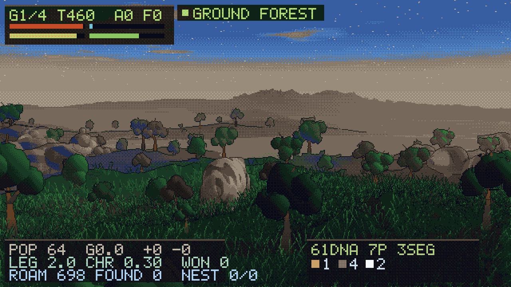 | 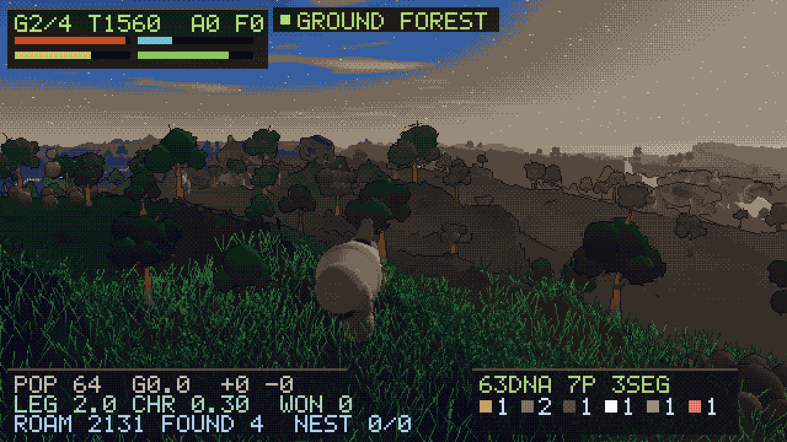 |
|---|---|
| 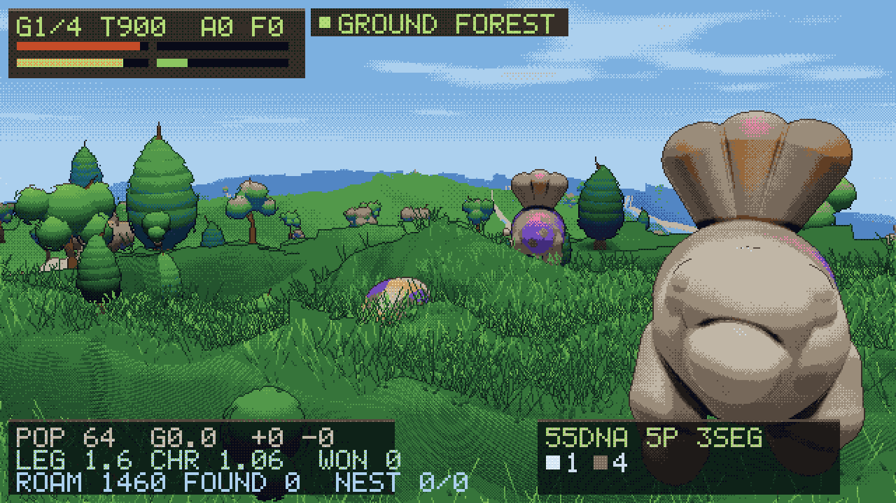 | 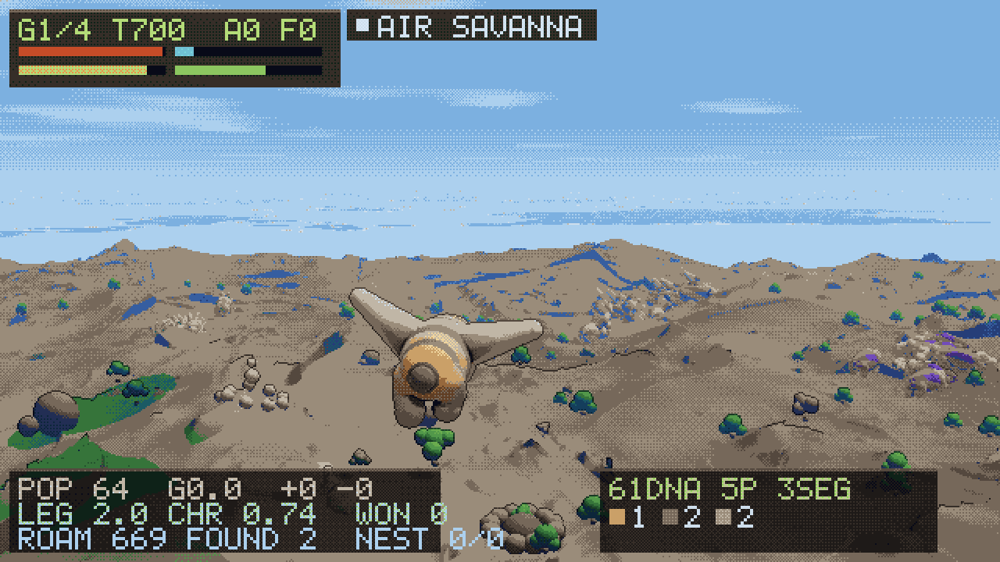 |

None of this touches the simulation: the 30-seed table came back byte-identical
after the whole pass. It does cost render time — a 640x360 frame is about eight
seconds, four times the 320x180 styles, and the terrain marcher is the whole of
it. Rendering is off the training path entirely, which is the point of having
kept `cp4_world_step` a pure function of state all along.

## Stage 4: civilisation


The scale changes but the planet does not — stage 4 lays its cities on the same
`cp4_height()` field stage 3 walked over, from the same seed. This is the one
stage that is a map rather than a camera: the readable state is who owns what,
and a perspective view hides exactly that.

Three ways to take a city, and they are three mechanics rather than one wearing
three hats. Over six seeds each, forced to a single approach:

| approach | spends | takes | mean population held |
|---|---|---|---|
| force | the target's walls | 74 cities | 53 — conquest costs the city half its people |
| trade | money, and pays itself back | 112 | 100 — cities arrive intact and keep growing |
| faith | time, and a garrison interrupts it | 43 | 40 |

What a species evolved in stage 3 arrives as three multipliers, so the body
decides the doctrine:

```python
land = LandEnv(seed=7)          # ... play the creature stage ...
civ  = CivEnv(seed=7, legacy=land.legacy())
```

```
predator  legacy M1.46 E1.00 R0.80  ->  4 cities taken, all by force
charmer   legacy M0.80 E1.00 R1.59  ->  4 cities taken, all by conversion
```

```
./build/cpore_civ --seed 9 --out civ.png
./build/cpore_civ --legacy 0.85,0.85,1.55 --every 600 --out frames.png
./build/cpore_civ --table          # every doctrine against twelve seeds
```

## Natural selection

The other animals are not props. Every fish carries a genome, burns energy to
live, and breeds with mutation when it has banked enough. Founders are drawn
uniformly from the design space — including animals that cannot feed
themselves — and **nothing in the simulation prefers a working body plan**. The
ones that eat leave more copies.

Over five independent oceans with no player in them (`make test`):

```
mean generation 5.6 per episode, mouths +0.38, tails +0.18
```

Run the shipped baseline for a full episode and the population moves on its
own:

```
founders          mouths 1.55  tails 0.62  photophores 0.27
after ~6 gens     mouths 2.18  tails 0.79  photophores 0.02
```

Mouths and tails rise because you cannot eat without one and cannot reach food
without the other. Photophores **fall** — they cost 14 DNA and only pay off
deep, and the plankton is shallow where there is already light. Nobody wrote
that rule down; it is what survived.

A bounded lifespan turned out to be the load-bearing detail. Without old age
the population sits at carrying capacity and every birth has to wait for a
violent death, so barely half a generation turned over per episode and there
was nothing to see. Capping lifespan makes *reproduction rate*, not survival
alone, the thing selection acts on — mean generations went from 0.3 to 5.6.


```
./build/cpore_aqua --seed 44 --steps 4200 --out aqua.png
./build/cpore_aqua --style diver --steps 6000 --out deep.png
./build/cpore_aqua --list-parts
```

## Why not just use Spore

Nobody has trained an RL agent on Spore, and nobody has published an LLM
playing it. The reasons are structural, and they are exactly the constraints
this project deletes:

| Spore | cpore |
| --- | --- |
| No scripting API, no headless mode | Sim core is a library with zero I/O |
| Runs at 1x real time, one instance | ~81k steps/s, 64 envs, one thread |
| A playthrough is tens of hours | An episode is ≤9000 steps (~2s of compute) |
| Five games with five interfaces | One world struct, per-stage rule sets |
| No way to save/restore mid-run | `memcpy`-able 22KB state |

The only real hook into the actual game is the
[Spore ModAPI](https://github.com/emd4600/Spore-ModAPI), a C++ library built on
Ghidra-assisted reverse engineering. It is enough to script the game, but it
does not fix throughput, so it is a demo path, not a training path.

## The editor

Stage 1 of 5 (**Cell**), with Spore's full cell-stage part roster. A genome is
up to 12 parts, each with a type and a body-relative mounting angle, bought
with DNA out of a per-generation budget.

| part | DNA | what it does |
| --- | --- | --- |
| filter mouth | 5 | eats plants |
| jaw | 10 | eats meat, and bites other cells through a 54° arc |
| proboscis | 16 | eats both, less efficiently than either specialist |
| cilia | 5 | sustained speed |
| flagella | 10 | acceleration, and the burst trigger |
| jet | 16 | top speed — but only its rearward component pushes |
| spike | 9 | contact damage through a 41° arc, and armour over that arc |
| electric | 20 | radial discharge on trigger, costs health, 1.6s cooldown |
| poison | 14 | retaliation damage to whatever is biting that side |
| eye | 6 | perception radius, 210 → 620 units |

Generation budgets are 30 / 55 / 85 / 125 DNA. Every part trades something
away: mass costs speed, weapons cost mobility, and a mouth you did not buy is
food you cannot eat.

**Placement is read by the simulation, not just the renderer.** Contact
damage, armour, poison retaliation and jet thrust are all resolved against the
angle a part is mounted at. Measured directly (`make test`, with the player
pinned and a target held dead ahead):

```
spike forward: dealt 600  taken 624   |  spike aft: dealt 0  taken 760
jet aft thrust 165                    |  jet forward thrust 0
cell sightings over 1200 steps - blind: 1626  |  two eyes: 3762
```

Same parts, same cost, different outcome.

## Generations

Spore hands you the editor every time the DNA meter fills a segment. Here the
**design head of the action vector is sampled at exactly that moment** and
ignored on every other step, which keeps the whole thing a plain Box action
space that ordinary PPO can drive:

```
action[0..1]   steering x/y
action[2]      flagella burst
action[3]      electric discharge
action[4..27]  (part type, mount angle) x 12 slots   <- read at generation boundaries
```

A policy that only drives the first four dimensions leaves the design head at
exactly zero; that is the signal to fall back on the scripted designer, so a
control-only agent still works out of the box.

Observations are 97 floats: self state, 8 nearest edible food, 6 nearest cells,
own part counts, and derived stats. Food and cells beyond the build's
perception radius are zeroed — eyes buy information.

## Layout

```
include/cpore/cpore.h   one public header, flat C ABI
src/genome.c            parts, costs, budgets, the editor's action decoding
src/world.c             the simulation (no I/O, no allocation, no globals)
src/policy.c            scripted baseline, design head included
src/env.c               RL wrapper: reset/step/observe/save/load
src/aqua_genome.c       3D body plans: parts, costs, mutation
src/aqua.c              the aquatic simulation, including the breeding population
src/aqua_env.c          stage-2 RL wrapper
src/land_genome.c       land body plans: parts, budgets, styles
src/land.c              the creature simulation: four media, nests, impress-or-eat
src/land_env.c          stage-3 RL wrapper
src/civ.c               the civilisation simulation: cities, units, doctrines
src/civ_env.c           stage-4 RL wrapper, and the bridge from stage 3
src/render.c            pixel-art rasteriser, six styles, palette-quantised
src/render_cell.c       stage 1's HDR darkfield renderer: the `drop` style
src/pixfont.h           the 5x7 font, shared by both paths
src/sdfbody.h           the shared SDF body: round cones under a smooth minimum
src/render3d.c          sphere-impostor z-buffer renderer for stage 2
src/render_land.c       ray-marched heightfield, sky and creatures for stage 3
src/render_civ.c        orthographic map, territory and borders for stage 4
src/png.c               PNG + DEFLATE encoder
python/cpore/           ctypes binding, works without numpy
apps/                   cpore_shot, cpore_aqua, cpore_land, cpore_civ, cpore_bench
tests/test_core.c       determinism, snapshot, budgets, and every stage's balance
```

The sim never includes the renderer, so a training build can drop
`render.c`/`png.c` entirely.

## Python

```python
from cpore import CporeEnv, genome, FRONT, BACK

env = CporeEnv()
obs = env.reset(seed=23, parts=genome(
    ("jaw",   FRONT),      # teeth in front
    ("spike", 16),
    ("cilia", 112),        # propulsion aft
    ("cilia", 144),
    ("eye",   32),
))
obs, reward, terminated, truncated, info = env.step(env.greedy_action())
print(env.genome(), env.genome_cost(), env.generation)
env.save_png("frame.png")
```

`make lib && python3 python/smoke_test.py` checks the whole path. Overspending
is trimmed by the C side, so a caller cannot smuggle in a build it has not paid
for. `make_gym_env()` returns a `gymnasium.Env` if gymnasium and numpy are
installed; nothing else requires them.

## Numbers

Single thread, `-O2`, on the machine this was developed on:

```
stage 1 (cell)   state 22776 B   obs  97   act 28

64 envs                                  1 env
  step only              81k steps/s       182k steps/s
  step + observe         73k steps/s       178k steps/s
  step + observe + base  60k steps/s       153k steps/s

stage 3 (creature)   state 39648 B   obs 168   act 58
  step + observe + baseline            25.5k steps/s
```

Stage 3 carries far more per step — 440 plants, 64 animals, four media and a
terrain field sampled several times per animal — so it will never match the
cell stage. It did start at 7.6k though: the NPC feeding pass was every animal
against every plant, sixty-four times five hundred every step. A spatial hash
over the flora, keyed by hashed cell coordinates because the world has no
bounds to index against, took it to 25.5k. Every read goes through one macro
and every write through one function, so the grid cannot drift out of step with
the array it describes.

Read that as roughly **30M entity-updates/s** — every step advances ~370
entities, so this is not comparable to a 1M-steps/s Pong. The 64-env number is
lower than the 1-env number because 64 worlds is a 1.4MB working set and every
step touches all of it; structure-of-arrays, then sharding across cores, is the
next fix.

The first working version ran at 28k steps/s aggregate. The wins, in order of
size, were re-planning NPC foraging targets in a staggered burst instead of
every cell every frame, maintaining the food lookup grid incrementally instead
of rebuilding it per step, and resolving NPC collisions through a coarse grid
instead of all-pairs.

## Baseline

`cp_policy_greedy` is a scripted heuristic with no memory and no notion of the
DNA goal. It is the bar a learned policy has to clear. Starting from each
scripted style, 40 seeds each:

| style | evolved | died | mean episode | kills | damage dealt |
| --- | --- | --- | --- | --- | --- |
| grazer | 38/40 | 2 | 2049 | 28 | 526 |
| scout | 37/40 | 3 | 3925 | 191 | 8330 |
| tank | 34/40 | 6 | 3049 | 26 | 551 |
| hunter | 33/40 | 6 | 3900 | 166 | 5990 |

Every branch of the editor is viable, and the styles genuinely play
differently — grazing finishes in half the time, hunting does 15x the damage.

## What had to be fixed to get here

All of it found by running the table, not by reading the code:

- **Pure carnivores could not bootstrap** — no meat exists until something
  dies — so a fraction of ambient food is now dead plankton.
- **The baseline refused to hunt below 55% health**, putting predators in a
  starvation spiral: too weak to hunt, so only scavenging, so still too weak.
- **The baseline pinned itself against its own wall-avoidance threshold.** A
  constant push switching on at a fixed distance exactly cancels a unit-length
  target attraction, so the agent parked on that line and starved with prey
  100px away.
- **Combat was a rounding error.** With 470 food in the pool, grazing filled
  the DNA meter so easily that weapons never mattered — 1 kill per 7,500 steps,
  and the best build was the one that never fought. Thinning the pool to 320
  and trimming plant DNA made the pool contested; kills went up ~15x and the
  weapon parts started earning their cost.
- **The scripted designer bought its signature part first.** At a 30-DNA
  gen-0 budget the tank spent everything on spikes, ended up with no cilia, and
  died to the first thing that chased it. Buy order is now mobility first.
- **`jet_thrust` counted jets instead of reading their angles**, so the
  header's "only rear-facing jets help" was a comment describing code that did
  not exist. Now it sums each nozzle's rearward component.

## Known limits

- Placement is decisive at the mechanic level (see the numbers above), but
  across full episodes under the scripted baseline the effect is **within
  seed-to-seed noise**. The baseline always faces its direction of travel and
  charges prey head-on, so it never exercises the trade-off between forward
  weapons and rear armour. Demonstrating that trade-off needs a learned policy;
  the mechanic is in place and measured, the behaviour is not yet shown.
- The scripted designer spends 107 of 125 DNA at the final generation. It is a
  fixed buy list, not a planner.
- Grazing is still the shortest path. That is partly true to Spore and partly
  an artifact of a heuristic that is good at chasing pellets.

## Roadmap

Full version, including what is deliberately *not* being done and why, in
[docs/ROADMAP.md](docs/ROADMAP.md).

1. Structure-of-arrays world layout, then shard envs across cores.
2. PPO on the cell stage, jointly over control and the design head — does a
   learned policy reorder that table, and does it learn to put spikes forward?
3. Carry the evolving population back into stage 1, and let the player's own
   genome enter the same gene pool.
4. Creature stage on land: legs instead of fins, terrain, and pack behaviour.
5. Tribal, Civ, Space as further rule sets over the same state.

## Visual styles

Seven, and `drop` is not one of the others. Six are a pixel-art pipeline and
are not palette swaps of each other — internal resolution, camera scale,
dither strength, background value structure and outline treatment all move
together. `drop` is a separate renderer down a separate path: continuous tone,
HDR, no palette, no dither, no upscale. `--vis NAME`, or
`CporeEnv(vis="c64")` from python. Stage 1 defaults to `drop`, stage 2 to
`abyss`, the land stage to `terra`; asking a stage for a style it cannot
render gets that stage's own default back.

| style | resolution | colours | look |
| --- | --- | --- | --- |
| `drop` | output res | continuous | darkfield microscopy: black field, translucent bodies, bloom, bokeh, a lens |
| `terra` | 640x360 | 48 | daylight land: a six-step sky, two foliage ramps, warm rock |
| `petri` | 320x180 | 16 | cream paper, ink outlines, muted pigment — the only one with an inverted value structure |
| `abyss` | 320x180 | 32 | deep water, dithered gradient, dark keylines |
| `neon` | 320x180 | 16 | near-black void, saturated arcade colour, outlines brighter than fills |
| `c64` | 160x90 | 16 | the actual Commodore 64 hardware palette, flat field, black keylines |
| `dmg` | 160x90 | 4 | original Game Boy greens, and nothing else |

`terra` exists because `abyss` was mixed for a lit water column: seven blues,
five greens and no sky at all. Every land frame drawn with it spent its sky on
the cyan ramp and its distance on the two neutrals, which is why the first
landscapes ended in a grey wall. It is also the only style at 640x360 — one
animal against open water reads fine at 320x180, but a landscape is ridgelines
and treelines, and those are the first thing to dissolve.

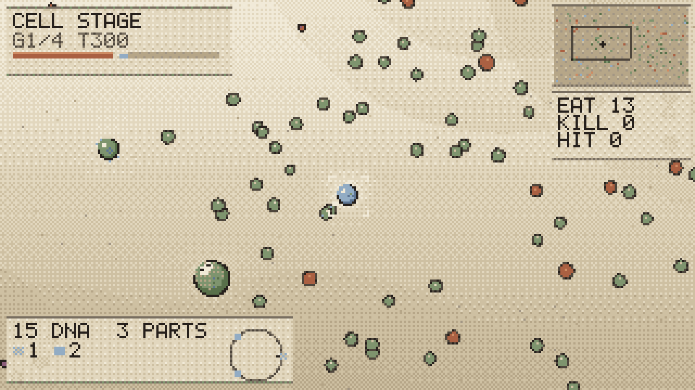


`--vis-all` renders the identical terminal state in every style, which is the
only fair way to compare them — and the fairest thing it shows is how much of
the pixel styles' character came from the constraint rather than the palette.

`drop` needed a different renderer rather than a seventh palette, because
almost nothing in the pixel path survives removing the palette. Coverage is
thresholded, which reads as deliberate only while every edge sits on the pixel
grid; the shading is tuned against a fixed set of 32 colours; and the bloom
and outline passes exist to fight quantisation artefacts that are no longer
there. What it does share is the 5x7 font, and even that is used differently —
the pixel path stamps each set bit as a hard square, `drop` stamps it as a soft
dot, which turns the same table into a dot-matrix instrument readout that
blooms like the rest of the frame.

Two of these needed structural work rather than a palette:

- **dmg** has four tones and no hue, so its ground has to be perfectly flat.
  Dithering a gradient across four colours produces a checkerboard that swamps
  every subject on screen — the first attempt was unreadable. Silhouette
  carries the whole image, so panels sit on the darkest tone and the field one
  step up.
- **neon** inverts the outline rule: the rim is the brightest thing on a
  shape, so the fill can sit almost black against an almost-black background.
  A dark keyline does nothing on a black field.

The 160x90 styles cannot fit the full HUD, so they drop to vitals plus the
placement dial.

## Rendering: the darkfield path

A cell in `drop` is a translucent bag, and the shading is the three things
light does to one. It is absorbed on the way through, so the thick middle of
the body is where the background goes away. It scatters off what is suspended
inside, which is why the interior is worth drawing at all — a nucleus with a
dense core, vacuoles that breathe on their own phase, and a granulated
cytoplasm, all hashed off the cell's slot so they are stable for the episode
and all rotated with its heading, because an interior that stays put while the
body turns reads as a decal. And it grazes the membrane on the way past, which
is the whole look: at a grazing angle the path through the membrane is long,
so the edge of a transparent body is the brightest thing on it.

Four things were not obvious, and three of them were bugs:

- **The fresnel exponent is the load-bearing number in the file.** Written at
  the 3.4 a 3D fresnel wants, essentially all of the rim term lands in the
  outermost two percent of the radius — which on a twenty-pixel cell is under
  one pixel, so the single effect the entire look is built on rendered as
  nothing. On a projected disc the falloff has to be broad enough to occupy a
  band the eye can see. The membrane line has the same problem and is held to
  a minimum width in screen space rather than a fraction of the radius.
- **An additive buffer cannot draw anything dark.** A pupil, a mandible, the
  throat of a jet: drawn by adding a dark colour they come out as slightly
  brighter patches of whatever was behind them. They multiply instead, and the
  lit parts are added on top — the same two-step the membrane already used.
  The pupil in particular is the darkest thing on the animal and the reason an
  eye has any contrast, which is most of why Spore's creatures read at all.
- **Exposure has to be one number in one place.** Every intensity here is
  scene-referred against six named reference levels, and how far up the
  tonemapping curve that set lands is a separate decision at the bottom of the
  file. Mixed together, changing how bright the frame is means retuning forty
  constants — which is exactly the hole the first pass fell into.
- **A smoothstep with its edges reversed is a descending ramp, not an error.**
  Guarding against `e1 < e0` and returning a constant silently multiplied the
  whole frame by the far end of the vignette, and cost the image every stop
  above about 15%. It looked like an art problem for three iterations.

Post is four octaves of bloom before the tonemap — one blur radius gives one
halo size and reads as a filter, and after the tonemap there is nothing above
white left to bleed — then a grade, lateral chromatic aberration scaled by
`r^2`, a vignette and grain. The grain is not optional at this exposure: the
darkest quarter of the frame covers about six 8-bit codes, and without a
dither of some kind the condenser cone comes out as contour lines.

Depth of field is per-sprite rather than a screen-space gather. Each cell
hashes to a position in the drop and carries its own defocus width, which for
round shapes is both cheaper and closer to a real bokeh disc; defocus also
costs it brightness and saturation, so a crowded frame still has a foreground.
The player is always on the focal plane. One 1280x720 frame is about 180 ms.

## Rendering: the pixel path

The pixel renderer is a debug view, not a product, and that shaped the choices.
At those resolutions there is no room for soft shading, so every cell gets a
hard dark keyline, a fill and one highlight — without the keyline everything
dissolves into the water. The player is marked with four corner brackets rather than
concentric rings, because a ring drawn around a 10px cell is just noise on top
of the cell. Cells under 4px across skip their appendages entirely and draw as
blobs; there is nothing to be gained from a 1px spike.

Two HUD elements exist to make the editor legible: a swatch-and-count strip for
the parts owned, and a **placement dial** showing where each part actually sits
on the membrane, front pointing right. Since the simulation resolves damage,
armour and thrust against those angles, the dial is a readout of live state,
not decoration.

Both renderers link separately from the sim, so a training build drops them.

## Legal

Mechanics are reimplemented from scratch. No Spore assets, model data, or file
formats are used, and none should be added. All art here is procedural and
generated by `src/render.c` and `src/render_cell.c`.
