# cpore

A Spore-like life simulation written from scratch in C, built to be a
reinforcement learning environment rather than a game.

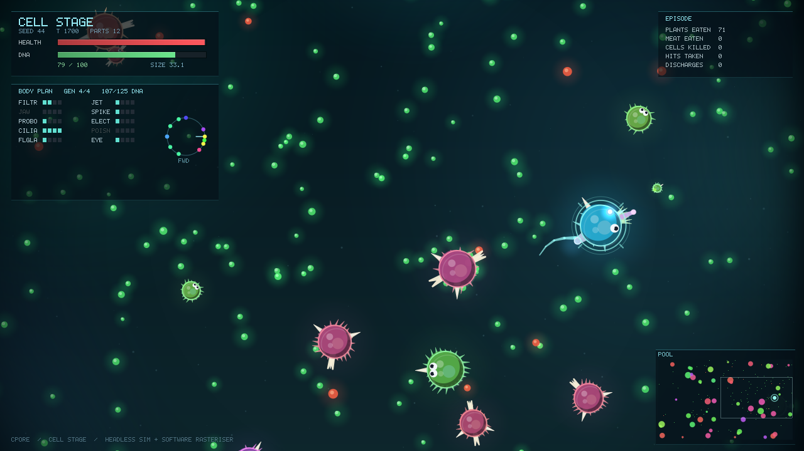

Dependencies: `libc` and `libm`. No SDL, no OpenGL, no zlib, no stb.

That screenshot is a pixel-art pipeline written from scratch: the scene is
rasterised into a small buffer with hard-edged primitives (coverage is
thresholded at the pixel centre, never blended), quantised to a fixed palette
with 4x4 ordered dithering, then blown up with nearest-neighbour. The PNG was
compressed by a DEFLATE implementation in this repo — the small palette also
cut the file from ~500KB to ~60KB, since few colours suit LZ77 well.

```
make && make test && make bench
./build/cpore_shot --list-parts
./build/cpore_shot --style hunter --seed 23 --steps 2600 --out shot.png
./build/cpore_shot --parts 2:0,7:16,4:112,4:144 --out custom.png
./build/cpore_shot --vis-all --out compare.png      # every style, same frame
```

## Stage 2: aquatic, in 3D

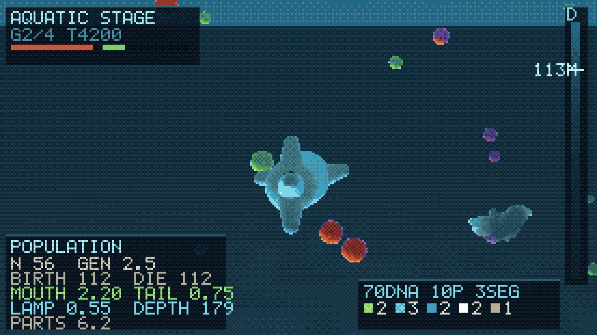

A real volume of water — 1400 x 620 x 1400, surface above, seabed below, and
**depth as a genuine axis of the problem**. Light falls off exponentially with
depth, plankton blooms near the surface, carrion sinks. A build that cannot see
in the dark cannot hunt there, so photophores are the only sight you can buy
that the depth cannot take away.

Body plans are three-dimensional: a genome is a spine of 2–6 segments plus up
to 10 parts, each mounted at **a segment index and a yaw/pitch on that
segment** — a direction in 3D, not an angle on a circle. Bite cones, armour
coverage and thrust are all resolved against those directions.

### Every animal is different

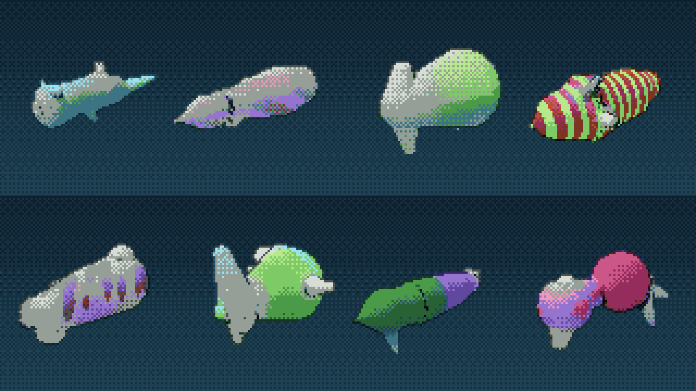

`./build/cpore_aqua --gallery 3 --seed 5` — eight genomes drawn at random from
the same design space.

Getting there needed the genome to carry things that actually change a
silhouette. It used to have one `girth` scalar and a straight spine, which is
combinatorially large and visually tiny — every fish was the same shape in one
of six tints. It now carries:

- a **four-station radius profile** along the body, which is the difference
  between "fatter" and eels, discs, barrels and tadpoles
- **arch and sweep**, bowing the spine up/down and sideways
- **per-part scale**, so a fin is not always fin-sized
- **bilateral symmetry as a gene** — a mirrored part exists on both flanks and
  costs twice. This is the single thing that makes a generated body read as an
  animal rather than a lump, so it is inherited, mutated and paid for.
- a **colour genome**: base and marking hue, saturation, value, and one of
  plain / bands / spots / countershading, at a mutable frequency

Colour carries as much perceived variety as shape and is far cheaper, so it
gets its own genes and its own inheritance. Markings are deliberately crisp
rather than gradients, because a 32-colour palette punishes soft ramps.

| part | DNA | what it does |
| --- | --- | --- |
| filter / jaw | 5 / 12 | plankton / meat, and bites through a cone |
| fin / tail | 6 / 8 | turn rate / forward thrust |
| spike / plate | 10 / 12 | directional damage and armour / flat armour, heavy |
| eye | 6 | perception — but multiplied by how much light there is |
| lung | 10 | buoyancy control, so holding a depth stops costing thrust |
| light | 14 | a photophore: sight the depth cannot take away |

### Rendering bodies

Creatures are a **signed distance field unioned with a smooth minimum**, ray
marched per pixel. That one operator is the difference between a body and a
bag of parts: `smin()` fillets every junction instead of letting primitives
intersect as separate lobes. It also sidesteps the entire mesh pipeline — no
triangles, no UVs, no rigging — which is exactly why it suits bodies that are
generated rather than authored.

| before: plain union, sphere impostors | after: smooth-minimum SDF |
| --- | --- |
| 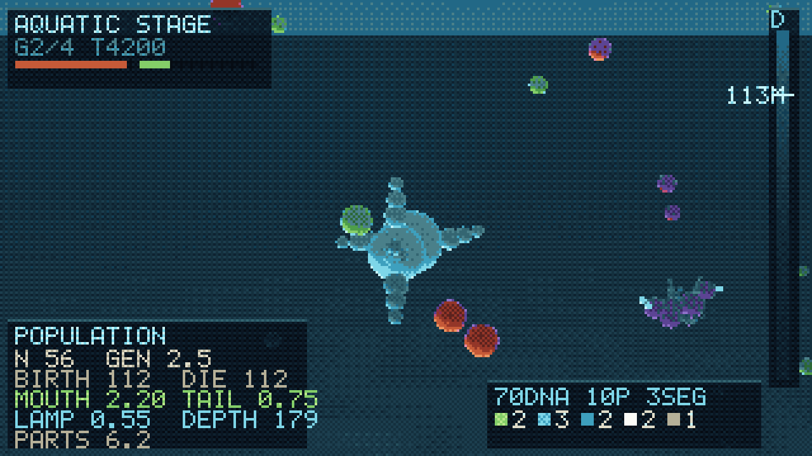 |  |

The clamp inside `creature_sdf` is load-bearing, and the first attempt did not
have it. Chaining `smin()` over sixteen primitives compounds its correction
term — each union can subtract up to `k/4` — so with a generous blend radius
the field collapses far outside the body, the marcher hits the bounding sphere
immediately, and every animal renders as one enormous ball. Tracking the true
minimum alongside and refusing to blend more than one fillet below it keeps the
field honest however many parts a genome piles on.

### Lighting

Key, fill and ambient are separate terms with real separation between them,
because one flat ambient floor squeezed every surface into the same six mid
tones and left the palette's darks and brights unused. Occlusion and soft
shadows come straight out of the distance field. Output is tonemapped
filmically rather than clamped — three light terms plus emissive routinely
exceed 1.0, and clipping turns a bright surface into a flat plate of one
colour that then quantises to a single palette entry, throwing away the shape
underneath.

Two bugs worth recording. Fog was mixing every surface toward blue-grey before
quantisation, so saturated genomes arrived desaturated and landed on neutral
palette entries; it is now held off for the first 90 units, which keeps
foreground animals at full chroma while still burying the distance. And the
sun vector pointed *up* — y is depth here, so light travelling down from the
surface is +y, and with −1 the key lit every belly and left every back black.

Depth also carries caustics on the seabed, light shafts along the sun's
bearing, projected shadow patches that widen and fade with an animal's height,
and drifting streaked marine snow. A depth-discontinuity outline pass runs last
and is the cheapest readability win in the file.

Everything else is still a **sphere impostor into a z-buffer**: centres are
projected, screen-space circles rasterised, depth and normal solved per pixel.
Surface and seabed are analytic ray-plane intersections. Creatures smaller than
9 px on screen fall back to impostors, since ray marching a body costs far more
than splatting spheres and at that size nobody can tell. A 320x180 frame costs
roughly 40 ms. Output goes through the same palette pipeline as stage 1.

## Stage 3: creature, on land

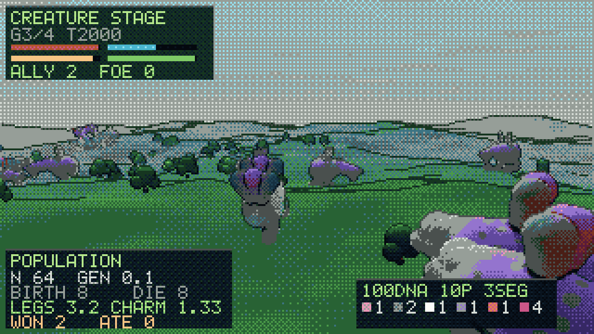

Out of the water and onto a heightfield. `cp4_height()` is a pure function of
seed and position, so the world stores no terrain at all — the simulation asks
for the ground under an animal's feet, the renderer asks for it wherever a ray
happens to land, and a snapshot is still a `memcpy` of one POD struct. The same
seed always grows the same hills.

The subject of the stage is other species. Seven rival nests each hold a
lineage that breeds, mutates and is selected by whether its occupants can feed
themselves, and every encounter is the fork Spore built its creature stage
around — **impress it or eat it**. Both fill the DNA meter, and they are bought
out of the same budget, so charm and violence genuinely compete for parts:

| build | how it fills the meter | 6 seeds |
|---|---|---|
| grazer | plants for food, songs for DNA | reaches half the meter 6/6 |
| predator | kills, 4–11 per run, no songs at all | 6/6 |
| charmer | songs, 3–4 whole species won over | 6/6 |

Legs are a two-bone chain that reaches the actual ground plane and swings on
the gait phase, because on land the contact between animal and terrain is the
first thing the eye checks.

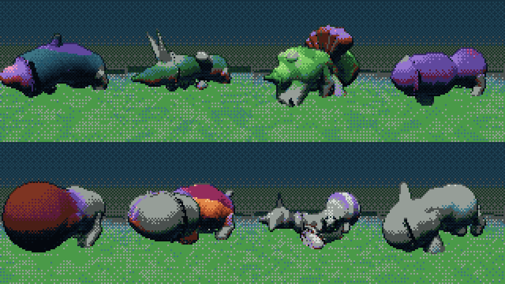

```
./build/cpore_land --list-parts
./build/cpore_land --style charmer --seed 21 --steps 2000 --out land.png
./build/cpore_land --gallery 3 --seed 11 --out gallery.png
```

## Stage 4: civilisation

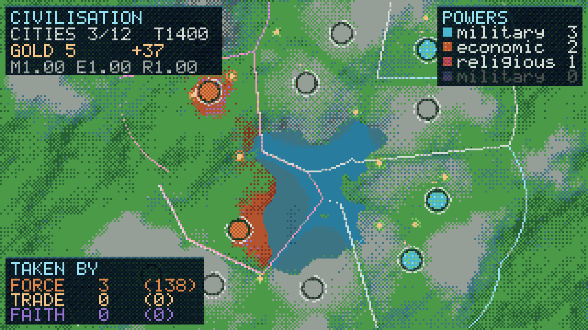

The scale changes but the planet does not — stage 4 lays its cities on the same
`cp4_height()` field stage 3 walked over, from the same seed. This is the one
stage that is a map rather than a camera: the readable state is who owns what,
and a perspective view hides exactly that.

Three ways to take a city, and they are three mechanics rather than one wearing
three hats. Over six seeds each, forced to a single approach:

| approach | spends | takes | mean population held |
|---|---|---|---|
| force | the target's walls | 74 cities | 53 — conquest costs the city half its people |
| trade | money, and pays itself back | 112 | 100 — cities arrive intact and keep growing |
| faith | time, and a garrison interrupts it | 43 | 40 |

What a species evolved in stage 3 arrives as three multipliers, so the body
decides the doctrine:

```python
land = LandEnv(seed=7)          # ... play the creature stage ...
civ  = CivEnv(seed=7, legacy=land.legacy())
```

```
predator  legacy M1.46 E1.00 R0.80  ->  4 cities taken, all by force
charmer   legacy M0.80 E1.00 R1.59  ->  4 cities taken, all by conversion
```

```
./build/cpore_civ --seed 9 --out civ.png
./build/cpore_civ --legacy 0.85,0.85,1.55 --every 600 --out frames.png
./build/cpore_civ --table          # every doctrine against twelve seeds
```

## Natural selection

The other animals are not props. Every fish carries a genome, burns energy to
live, and breeds with mutation when it has banked enough. Founders are drawn
uniformly from the design space — including animals that cannot feed
themselves — and **nothing in the simulation prefers a working body plan**. The
ones that eat leave more copies.

Over five independent oceans with no player in them (`make test`):

```
mean generation 5.6 per episode, mouths +0.38, tails +0.18
```

Run the shipped baseline for a full episode and the population moves on its
own:

```
founders          mouths 1.55  tails 0.62  photophores 0.27
after ~6 gens     mouths 2.18  tails 0.79  photophores 0.02
```

Mouths and tails rise because you cannot eat without one and cannot reach food
without the other. Photophores **fall** — they cost 14 DNA and only pay off
deep, and the plankton is shallow where there is already light. Nobody wrote
that rule down; it is what survived.

A bounded lifespan turned out to be the load-bearing detail. Without old age
the population sits at carrying capacity and every birth has to wait for a
violent death, so barely half a generation turned over per episode and there
was nothing to see. Capping lifespan makes *reproduction rate*, not survival
alone, the thing selection acts on — mean generations went from 0.3 to 5.6.

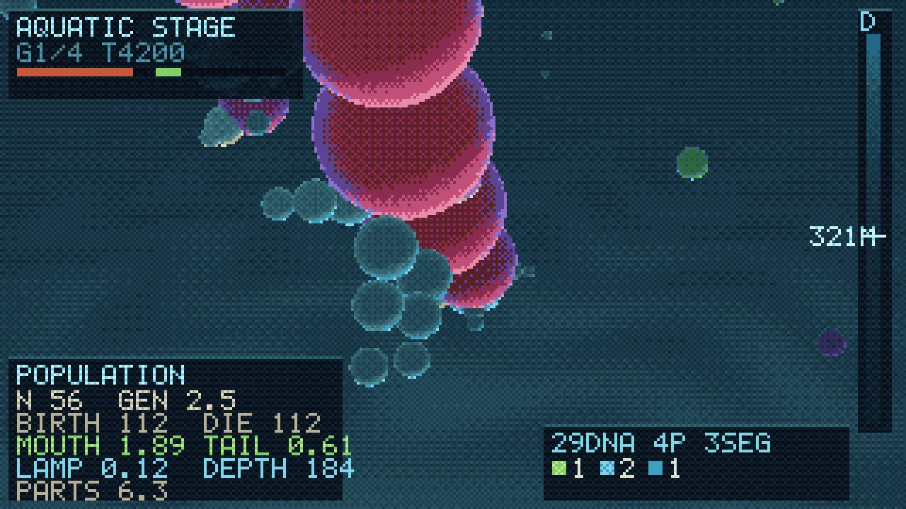

```
./build/cpore_aqua --seed 44 --steps 4200 --out aqua.png
./build/cpore_aqua --style diver --steps 6000 --out deep.png
./build/cpore_aqua --list-parts
```

## Why not just use Spore

Nobody has trained an RL agent on Spore, and nobody has published an LLM
playing it. The reasons are structural, and they are exactly the constraints
this project deletes:

| Spore | cpore |
| --- | --- |
| No scripting API, no headless mode | Sim core is a library with zero I/O |
| Runs at 1x real time, one instance | ~81k steps/s, 64 envs, one thread |
| A playthrough is tens of hours | An episode is ≤9000 steps (~2s of compute) |
| Five games with five interfaces | One world struct, per-stage rule sets |
| No way to save/restore mid-run | `memcpy`-able 22KB state |

The only real hook into the actual game is the
[Spore ModAPI](https://github.com/emd4600/Spore-ModAPI), a C++ library built on
Ghidra-assisted reverse engineering. It is enough to script the game, but it
does not fix throughput, so it is a demo path, not a training path.

## The editor

Stage 1 of 5 (**Cell**), with Spore's full cell-stage part roster. A genome is
up to 12 parts, each with a type and a body-relative mounting angle, bought
with DNA out of a per-generation budget.

| part | DNA | what it does |
| --- | --- | --- |
| filter mouth | 5 | eats plants |
| jaw | 10 | eats meat, and bites other cells through a 54° arc |
| proboscis | 16 | eats both, less efficiently than either specialist |
| cilia | 5 | sustained speed |
| flagella | 10 | acceleration, and the burst trigger |
| jet | 16 | top speed — but only its rearward component pushes |
| spike | 9 | contact damage through a 41° arc, and armour over that arc |
| electric | 20 | radial discharge on trigger, costs health, 1.6s cooldown |
| poison | 14 | retaliation damage to whatever is biting that side |
| eye | 6 | perception radius, 210 → 620 units |

Generation budgets are 30 / 55 / 85 / 125 DNA. Every part trades something
away: mass costs speed, weapons cost mobility, and a mouth you did not buy is
food you cannot eat.

**Placement is read by the simulation, not just the renderer.** Contact
damage, armour, poison retaliation and jet thrust are all resolved against the
angle a part is mounted at. Measured directly (`make test`, with the player
pinned and a target held dead ahead):

```
spike forward: dealt 600  taken 624   |  spike aft: dealt 0  taken 760
jet aft thrust 165                    |  jet forward thrust 0
cell sightings over 1200 steps - blind: 1626  |  two eyes: 3762
```

Same parts, same cost, different outcome.

## Generations

Spore hands you the editor every time the DNA meter fills a segment. Here the
**design head of the action vector is sampled at exactly that moment** and
ignored on every other step, which keeps the whole thing a plain Box action
space that ordinary PPO can drive:

```
action[0..1]   steering x/y
action[2]      flagella burst
action[3]      electric discharge
action[4..27]  (part type, mount angle) x 12 slots   <- read at generation boundaries
```

A policy that only drives the first four dimensions leaves the design head at
exactly zero; that is the signal to fall back on the scripted designer, so a
control-only agent still works out of the box.

Observations are 97 floats: self state, 8 nearest edible food, 6 nearest cells,
own part counts, and derived stats. Food and cells beyond the build's
perception radius are zeroed — eyes buy information.

## Layout

```
include/cpore/cpore.h   one public header, flat C ABI
src/genome.c            parts, costs, budgets, the editor's action decoding
src/world.c             the simulation (no I/O, no allocation, no globals)
src/policy.c            scripted baseline, design head included
src/env.c               RL wrapper: reset/step/observe/save/load
src/aqua_genome.c       3D body plans: parts, costs, mutation
src/aqua.c              the aquatic simulation, including the breeding population
src/aqua_env.c          stage-2 RL wrapper
src/land_genome.c       land body plans: parts, budgets, styles
src/land.c              the creature simulation: terrain, nests, impress-or-eat
src/land_env.c          stage-3 RL wrapper
src/civ.c               the civilisation simulation: cities, units, doctrines
src/civ_env.c           stage-4 RL wrapper, and the bridge from stage 3
src/render.c            pixel-art rasteriser, five styles, palette-quantised
src/sdfbody.h           the shared SDF body: round cones under a smooth minimum
src/render3d.c          sphere-impostor z-buffer renderer for stage 2
src/render_land.c       ray-marched heightfield, sky and creatures for stage 3
src/render_civ.c        orthographic map, territory and borders for stage 4
src/png.c               PNG + DEFLATE encoder
python/cpore/           ctypes binding, works without numpy
apps/                   cpore_shot, cpore_aqua, cpore_land, cpore_civ, cpore_bench
tests/test_core.c       determinism, snapshot, budgets, and every stage's balance
```

The sim never includes the renderer, so a training build can drop
`render.c`/`png.c` entirely.

## Python

```python
from cpore import CporeEnv, genome, FRONT, BACK

env = CporeEnv()
obs = env.reset(seed=23, parts=genome(
    ("jaw",   FRONT),      # teeth in front
    ("spike", 16),
    ("cilia", 112),        # propulsion aft
    ("cilia", 144),
    ("eye",   32),
))
obs, reward, terminated, truncated, info = env.step(env.greedy_action())
print(env.genome(), env.genome_cost(), env.generation)
env.save_png("frame.png")
```

`make lib && python3 python/smoke_test.py` checks the whole path. Overspending
is trimmed by the C side, so a caller cannot smuggle in a build it has not paid
for. `make_gym_env()` returns a `gymnasium.Env` if gymnasium and numpy are
installed; nothing else requires them.

## Numbers

Single thread, `-O2`, on the machine this was developed on:

```
world state: 22776 bytes/env   obs dim: 97   act dim: 28

64 envs                                  1 env
  step only              81k steps/s       182k steps/s
  step + observe         73k steps/s       178k steps/s
  step + observe + base  60k steps/s       153k steps/s
```

Read that as roughly **30M entity-updates/s** — every step advances ~370
entities, so this is not comparable to a 1M-steps/s Pong. The 64-env number is
lower than the 1-env number because 64 worlds is a 1.4MB working set and every
step touches all of it; structure-of-arrays, then sharding across cores, is the
next fix.

The first working version ran at 28k steps/s aggregate. The wins, in order of
size, were re-planning NPC foraging targets in a staggered burst instead of
every cell every frame, maintaining the food lookup grid incrementally instead
of rebuilding it per step, and resolving NPC collisions through a coarse grid
instead of all-pairs.

## Baseline

`cp_policy_greedy` is a scripted heuristic with no memory and no notion of the
DNA goal. It is the bar a learned policy has to clear. Starting from each
scripted style, 40 seeds each:

| style | evolved | died | mean episode | kills | damage dealt |
| --- | --- | --- | --- | --- | --- |
| grazer | 38/40 | 2 | 2049 | 28 | 526 |
| scout | 37/40 | 3 | 3925 | 191 | 8330 |
| tank | 34/40 | 6 | 3049 | 26 | 551 |
| hunter | 33/40 | 6 | 3900 | 166 | 5990 |

Every branch of the editor is viable, and the styles genuinely play
differently — grazing finishes in half the time, hunting does 15x the damage.

## What had to be fixed to get here

All of it found by running the table, not by reading the code:

- **Pure carnivores could not bootstrap** — no meat exists until something
  dies — so a fraction of ambient food is now dead plankton.
- **The baseline refused to hunt below 55% health**, putting predators in a
  starvation spiral: too weak to hunt, so only scavenging, so still too weak.
- **The baseline pinned itself against its own wall-avoidance threshold.** A
  constant push switching on at a fixed distance exactly cancels a unit-length
  target attraction, so the agent parked on that line and starved with prey
  100px away.
- **Combat was a rounding error.** With 470 food in the pool, grazing filled
  the DNA meter so easily that weapons never mattered — 1 kill per 7,500 steps,
  and the best build was the one that never fought. Thinning the pool to 320
  and trimming plant DNA made the pool contested; kills went up ~15x and the
  weapon parts started earning their cost.
- **The scripted designer bought its signature part first.** At a 30-DNA
  gen-0 budget the tank spent everything on spikes, ended up with no cilia, and
  died to the first thing that chased it. Buy order is now mobility first.
- **`jet_thrust` counted jets instead of reading their angles**, so the
  header's "only rear-facing jets help" was a comment describing code that did
  not exist. Now it sums each nozzle's rearward component.

## Known limits

- Placement is decisive at the mechanic level (see the numbers above), but
  across full episodes under the scripted baseline the effect is **within
  seed-to-seed noise**. The baseline always faces its direction of travel and
  charges prey head-on, so it never exercises the trade-off between forward
  weapons and rear armour. Demonstrating that trade-off needs a learned policy;
  the mechanic is in place and measured, the behaviour is not yet shown.
- The scripted designer spends 107 of 125 DNA at the final generation. It is a
  fixed buy list, not a planner.
- Grazing is still the shortest path. That is partly true to Spore and partly
  an artifact of a heuristic that is good at chasing pellets.

## Roadmap

Full version, including what is deliberately *not* being done and why, in
[docs/ROADMAP.md](docs/ROADMAP.md).

1. Structure-of-arrays world layout, then shard envs across cores.
2. PPO on the cell stage, jointly over control and the design head — does a
   learned policy reorder that table, and does it learn to put spikes forward?
3. Carry the evolving population back into stage 1, and let the player's own
   genome enter the same gene pool.
4. Creature stage on land: legs instead of fins, terrain, and pack behaviour.
5. Tribal, Civ, Space as further rule sets over the same state.

## Visual styles

Five of them, and they are not palette swaps — internal resolution, camera
scale, dither strength, background value structure and outline treatment all
move together. `--vis NAME`, or `CporeEnv(vis="c64")` from python. Default is
`abyss`.

| style | resolution | colours | look |
| --- | --- | --- | --- |
| `petri` | 320x180 | 16 | cream paper, ink outlines, muted pigment — the only one with an inverted value structure |
| `abyss` | 320x180 | 32 | deep water, dithered gradient, dark keylines |
| `neon` | 320x180 | 16 | near-black void, saturated arcade colour, outlines brighter than fills |
| `c64` | 160x90 | 16 | the actual Commodore 64 hardware palette, flat field, black keylines |
| `dmg` | 160x90 | 4 | original Game Boy greens, and nothing else |


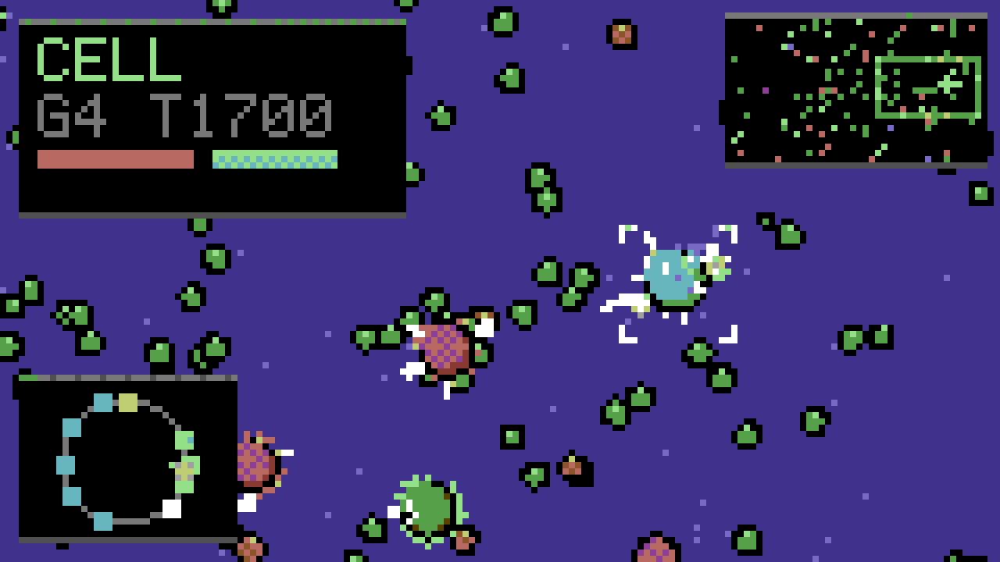
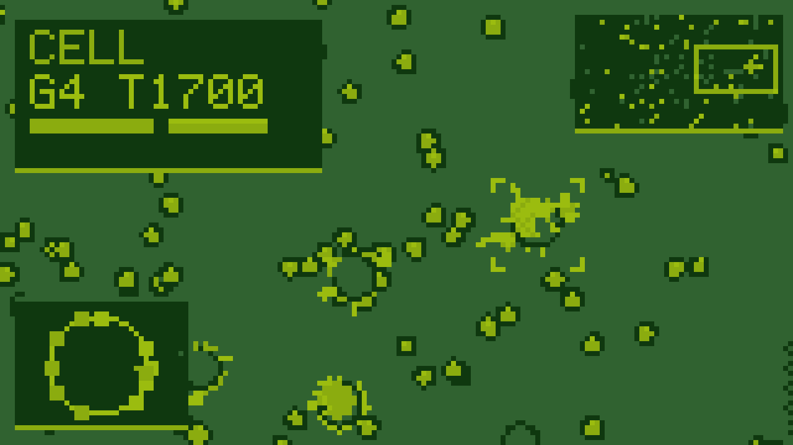
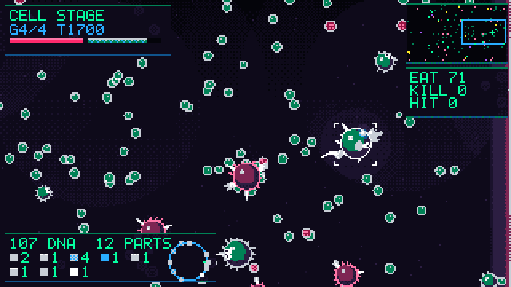
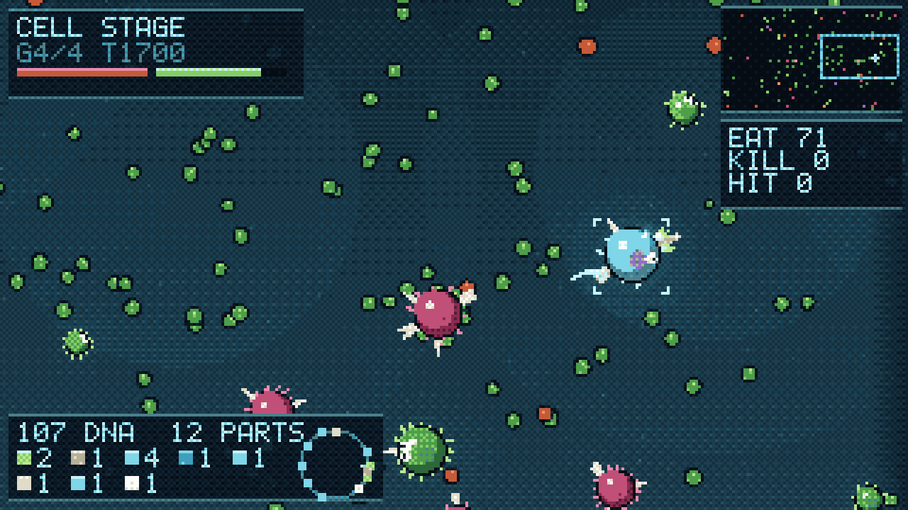

`--vis-all` renders the identical terminal state in every style, which is the
only fair way to compare them.

Two of these needed structural work rather than a palette:

- **dmg** has four tones and no hue, so its ground has to be perfectly flat.
  Dithering a gradient across four colours produces a checkerboard that swamps
  every subject on screen — the first attempt was unreadable. Silhouette
  carries the whole image, so panels sit on the darkest tone and the field one
  step up.
- **neon** inverts the outline rule: the rim is the brightest thing on a
  shape, so the fill can sit almost black against an almost-black background.
  A dark keyline does nothing on a black field.

The 160x90 styles cannot fit the full HUD, so they drop to vitals plus the
placement dial.

## Rendering

The renderer is a debug view, not a product, and that shaped the choices. At
these resolutions there is no room for soft shading, so every cell gets a hard dark
keyline, a fill and one highlight — without the keyline everything dissolves
into the water. The player is marked with four corner brackets rather than
concentric rings, because a ring drawn around a 10px cell is just noise on top
of the cell. Cells under 4px across skip their appendages entirely and draw as
blobs; there is nothing to be gained from a 1px spike.

Two HUD elements exist to make the editor legible: a swatch-and-count strip for
the parts owned, and a **placement dial** showing where each part actually sits
on the membrane, front pointing right. Since the simulation resolves damage,
armour and thrust against those angles, the dial is a readout of live state,
not decoration.

The whole file links separately from the sim, so a training build drops it.

## Legal

Mechanics are reimplemented from scratch. No Spore assets, model data, or file
formats are used, and none should be added. All art here is procedural and
generated by `src/render.c`.
